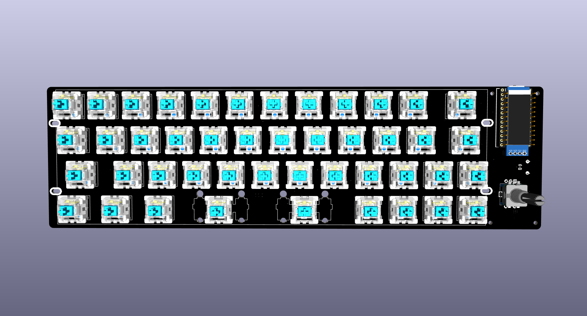
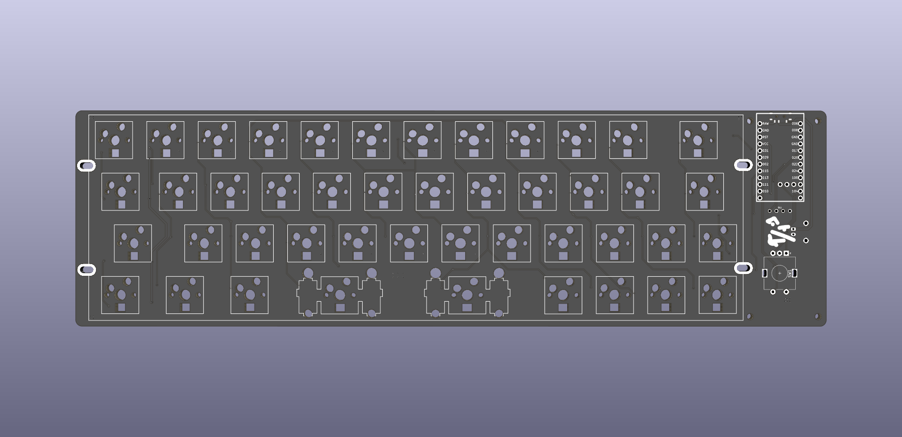
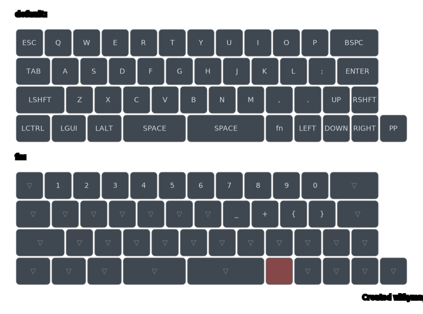

# td40
**TD40** is a compact 40% mechanical keyboard designed for efficiency and portability. It features hot-swappable switches, a rotary knob, an OLED display, wireless connectivity, and per-key RGB lighting.

## Features
* Using SMD soldering for clean PCB
* Using microcontroller Nice!Nano v2. So USB-C or Bluetooth is all compatible.
* a rotary encoders
* 0.91' OLED screen
* RGB per-key
* Hotswappable 
* Open and visible components (in the style of Plaid, Romac etc)
* Simple and flexible case options 

## Layout

## Bill of Materials

| # | Item                         | Quantity |
|---|------------------------------|----------|
| 1 | PCB                          | 1 |
| 2 | FR4 plate                    | 1 |
| 3 | Mica case                    | 1 |
| 4 | Controller (Nice!Nano v2)    | 1 |
| 5 | Switches (5-pin MX footprint)| 45 |
| 6 | Kailh hotswap socket         | 45 |
| 7 | Diodes                       | 46 |
| 8 | Rotary encoder & knob        | 1 |
| 9 | 0.91" OLED screen            | 1 |

